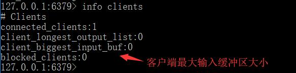
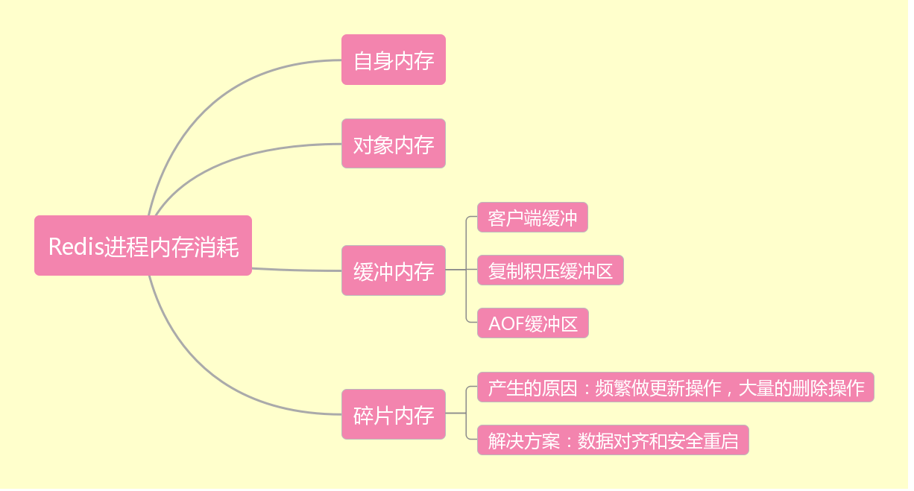
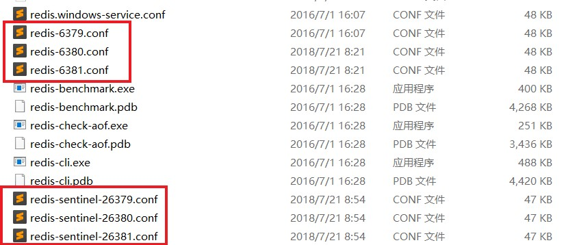
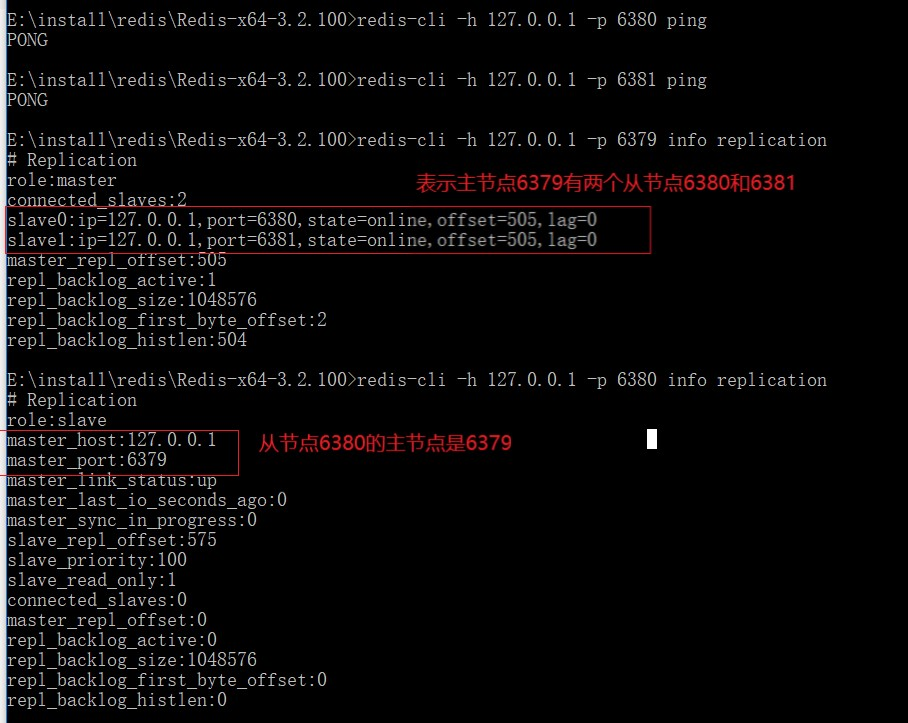
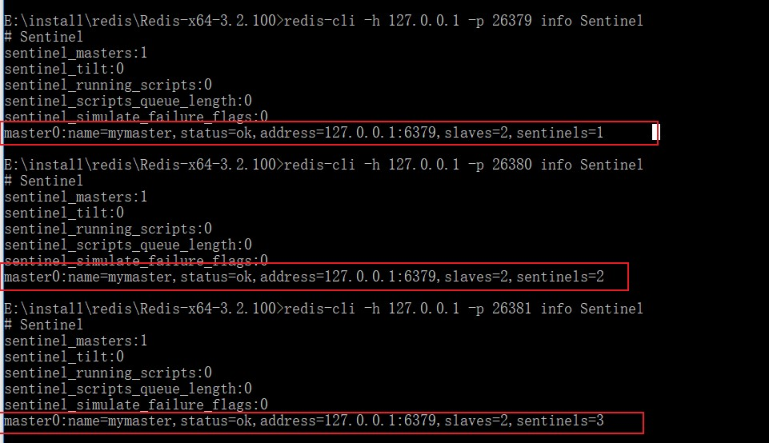

## 一.Redis是什么。

Redis是一个Key-Value的NoSQL数据库.

## 二.Redis的特点。

### 1.支持的数据结构：

hash,list,set,zset,string（memacached只支持string）。

### 2.单线程执行命令。

因为是单线程，所以减少了线程上下文切换的开销，同时如果一个命令执行时间过长就会引起阻塞。

### 3.数据存储

数据持久化到内存中，一定时间后会存储到磁盘中。

## 三.操作数据的命令

### 1.常用的命令

|命令|含义|
|:--------|:---|
|keys *|查看全部的键，会遍历Redis所有的键，时间复杂度是O(n)|
|scan cursor [match pattern][count number]|遍历键，cursor是游标|
|type key|查看键的类型,key是键的名称|
|dbsize |查看键的数量：dbsize 是直接获取Redis内置的键总量，时间复杂度是O(1)|
|exists key|判断某个键是否存在，存在返回1，不存在返回0.|
|del key[ key...]|返回成功删除键的个数|
|expire key time|设置键的过期时间|
|ttl key|查询某个键的剩余过期时间|
|object encoding key|查询键的内部编码|
|rename key newkey|键重命名|
|renamenx key newkey|当newkey不存在，键重命名成功|
|randomkey|随机选择一个键|
|persist key|清除键的过期时间|
|move key db|在Redis内部进行数据库迁移|
|dump + restore|在不同Redis实例间迁移数据|
|migrate|在数据库实例间迁移数据|

### 2.String数据结构

|命令|含义|
|:---|:---|
|set key value |插入键值对，key是键，value是值|
|get key |查看键的值|
|del key |删除键|
|setnx key value |当key不存在时，设置值|
|setex key seconds value |seconds是过期时间，设置键值对|
|mset key value[key value..]|批量获取值|
|mget key [key ...]|批量获取值|
|incr key|对值做自增1|
|decr key|对值做自减1|
|incrby key incrment|自增指定的数目 increment 数字|
|decrby key incrment|自减指定的数目 increment 数字|
|incrbyfloat key incrment|自增指定的浮点数 increment 数字|

内部编码有三种：int,embstr和raw

使用场景：
 - setnx和setex可用于分布式锁 
 
 - incr等可以用于计数
 
 - 统一管理用户的session
         
### 3.hash  

|命令|含义|
|:---|:---|
|hset key field value|设置hash的内容key=[{field:value}{field:value}]|
|hget key field|获取字段值|
|hdel key field|删除字段值|
|hlen key|获取key的字段数|
|hmset key field value [field value...]|批量设置key的field-value|       
|hmget key field1[field2...]|批量获得key的field的字段值|
|hexists key field|判断key的field是否存在|
|hkeys key|获取key的全部字段|
|hvals key|获取key的全部value值|
|hgetall key|获取key的全部field,value|
|hincrby key field incrment|key的字段field自增increment|
|hincrbyfloat key field increment|key的字段field自增浮点数increment|
|hstrlen key field|计算field的value的长度|

内部编码：ziplist和hashtable

### 4.list

|命令|含义|
|:---|:---|
|rpush key value[value...]|从列表右边添加元素|
|lpush key value[value...]|从列表左边添加元素|
|lrange key start end|获取指定索引范围的元素，0表示第一个，-1表示最后一个|
|linsert key before/after pivot value|在pivot元素前/后插入value元素|
|lindex key index|获取列表指定下标的元素|
|llen key|获取列表的长度|
|lpop key|从列表的左侧弹出元素|
|rpop key|从列表的右侧弹出元素|
|lrem key count value|从左到右删除count个值为value的元素|
|lset key index value|设置index位置的值|
|brpop/blpop key timeout|阻塞弹出,timeout是超时时间，0表示一直等待下去|

内部编码：ziplist(压缩列表)，linkedlist(链表)和quicklist

使用场景：

   - lpush+brpop=阻塞队列(消息队列)。
   
   - lpush+lpop=Stack(栈)
   
   - lpush+rpop=Queue(队列)
   
   - lpush+ltrim=Capped Collection(有限集合)

### 5.set

|命令|含义|
|:---|:---|
|sadd key element[element...]|添加元素|
|srem key element[element...]|删除元素|
|scard key|计算元素个数|
|sismember key element|判断element元素是否在集合中|
|srandmember key [count]|随机生成count个元素，默认是1个|
|spop key|随机弹出一个元素|
|smembers key|查询全部的元素|
|sinter key [key...]|查询多个集合的并集|
|sunion key [key...]|查询多个集合的交集|
|sdiff key [key...]|查询多个集合的差集|
|sinterstore destination key [key...]|查询多个集合的并集,存储到destination中|
|sunionstore destination key [key...]|查询多个集合的交集,存储到destination中|
|sdiffstore destination key [key...]|查询多个集合的差集,存储到destination中|

内部编码：intset,hashtable

使用场景：

  - sadd=Tagging(标签)
  
  - spop/srandmember=Random item(随机数抽奖)
  
  - sadd+sinter=Social Graph(社交需求)
         
        
### 6.zset

|命令|含义|
|:---|:---|
|zadd key score memeber[score memeber...]|添加成员|
|zcard key|计算成员个数|
|zscore key member|计算成员的分数|
|zrank/zrevrank key member|计算成员的排名|
|zrem key member[member...]|删除成员|
|zincrby key increment member|增加成员的分数|
|zrange/zrevrange key start end [withscores]|从低到高，返回指定排名范围的成员|
|zrangebyscore key min max [withscores] [limit offset count]|从低到高，返回指定分数范围的成员|
|zrevrangebyscore key max min [withscores] [limit offset count]|返回指定分数范围的成员|
|zcount key min max|返回指定范围的成员个数|
|zremrangebyrank key start end|删除指定排名内的升序元素|
|zremrangebyscore key min max|删除指定分数范围的成员|
|zinterstore destination numberkeys key [key...] [weights weight [weight...]] [aggregate sum/min/max]|两个有序集合的交集，numberkeys指有序集合进行交集的个数|
|zunionstore destination numberkeys key [key...] [weights weight [weight...]] [aggregate sum/min/max]|两个有序集合的并集，numberkeys指有序集合进行并集的个数|

内部编码：ziplist(压缩列表)和skiplist(跳跃表)

使用场景：

  - 排行榜(点赞)
  
### 7.Jedis对五种数据类型的操作

```
Jedis jedis = null;
try {
			
    jedis = new Jedis("127.0.0.1", 6379, 10000);
			
    //1.string
    String result1 = jedis.set("string1", "value1");
    String result2 = jedis.get("string1");
    System.out.println(result1);//OK
    System.out.println(result2);//value1
			
    //2.list
    long result3 = jedis.lpush("list1", "math","math","score","score","name","xiaoming");
    List<String> result4 = jedis.lrange("list1", 0, -1);
    System.out.println(result1);//OK
    System.out.println(result4);//xiaoming, name, score, score, math, math
			
    //3.hash
    jedis.hset("hash1", "subject","math");
    jedis.hset("hash1", "score","99");
    jedis.hset("hash1", "name","xiaoming");
    List<String> result5 = jedis.hmget("hash1", "subject","score","name");
    System.out.println(result5);//[math, 99, xiaoming]
			
    //4.set
    jedis.sadd("set1", "math","math","english","chinese");
    jedis.sadd("set2", "math","chinese","art");
    jedis.sinterstore("set3", "set1","set2");
    System.out.println(jedis.smembers("set3"));//[math, chinese]

    //5.zset
    jedis.zadd("zset1", 100, "math");
    jedis.zadd("zset1", 200, "chinese");
    jedis.zadd("zset1", 300, "english");
    Set<String> result6 = jedis.zrangeByScore("zset1", 100, 200);
    result6.forEach(string -> {
	System.out.print(string+" ");
    });//math chinese 
			
}catch(Exception e) {
    e.printStackTrace();
}finally {
    if(jedis != null) {
	jedis.close();
    }
}

```

## 四.客户端操作

### 1.client list

列出与Redis服务器相连的所有客户端信息。


属性如下：

|名称|含义|
|:---|:----|
|id|客户端的唯一标识。自增，重启后重置为0。|
|addr|客户端连接的地址和端口。|
|fd|socket的文件描述符。|
|name|客户端的名称。|
|age|当前客户端的连接时间。|
|idle|当前客户端的最近一次空闲时间。当age等于idle表示连接一直处于空闲状态。|
|flags|标识当前客户端的类型。|
|db|当前客户端正在使用的数据库索引下标。|
|sub|当前客户端订阅的频道或者模式数。|
|psub|当前客户端订阅的频道或者模式数。|
|multi|当前事务中已执行命令个数。|
|qbuf|输入缓冲区总容量。|
|qbuf-free|输入缓冲区的剩余容量。|
|obl|输出缓冲区的固定缓冲区的大小。|
|oll|输出缓冲区的动态缓冲区的大小。|
|omem|输出缓冲区使用的字节数。|
|events|文件描述符事件。|
|cmd|当前客户端最后一次执行的命令。|

## 2.输入缓冲区

作用：客户端发送的命令不是直接发送给Redis服务器，而是先存放在输入缓冲区，Redis服务器从输入缓冲区中获得命令并执行。

当输入缓冲区的输入速度大于Redis服务器的处理速度且存在大量的bigkey或是Redis服务器发生阻塞，短期不能执行命令时，都会造成输入缓冲区过大，可以通过client list查看qbuf和qbuf-free的大小或是通过info clients命令找到最大的输入缓冲区。



### 3.输出缓冲区

作用：Redis服务器执行命令后的结果不是直接返回给客户端，而是先存放在输出缓冲区。

输出缓冲区分为固定缓冲区和动态缓冲区，固定缓冲区是字节数组，动态缓冲区是列表，固定缓冲区使用完之后才会使用动态缓冲区。

通过client list和info clients可以监控输出缓冲区的异常情况。

### 4.客户端的分类

(1)普通客户端

(2)发布订阅客户端

(3)slave客户端

### 5.客户端操作

|命令|含义|
|:----|:----|
|config set maxclients value  |设置最大连接数 |
|config get maxclients |设置最大连接数 |
|info clients |查看当前已经连接的客户端数量|
|config set timeout value |设置超时时间，空闲时间一旦大于超时时间，客户端连接就会自动断开。|
|client setName value |设置客户端的名称|
|client getName |获得客户端的名称|
|client kill ip:port |关闭指定的ip:port的客户端|
|client pause timeout |(时间单位毫秒) 阻塞客户端timeout毫秒|

## 五.持久化

### 1.RDB

#### (1)概念

将当前线程数据生成快照保存在磁盘中。

#### (2)方式

a.手动触发

bgsave命令：Redis进程执行fork操作创建子进程，RDB的序列化由子进程完成，在fork阶段会出现堵塞。

b.自动触发

在某些情况下自动触发bgsave命令或是save命令。

#### (3)RDB的优缺点

a.优点

紧凑压缩的二进制文件，能够代表Redis在某个时间点的数据备份，可复制到不同的机器进行灾难恢复。Redis加载RDB恢复数据的速度快于AOF。

b.缺点

无法实现实时持久化，执行fork操作创建子进程是重量级操作，频繁执行成本较高，且老版本的Redis服务无法兼容新版本的RDB格式文件。

### 2.AOF

#### (1)概念

记录每次的写命令，重启后执行AOF文件中的命令以达到恢复数据的目的。可以用aof_enabled开启aof功能。

#### (2)特点

a.AOF命令以文本协议格式的形式写入内容到aof_buf中，再由aof_buf同步到硬盘中。文本协议格式具有很好的兼容性以及避免了二次处理的开销。而写入到aof_buf中是为了避免直接写入硬盘，以免硬盘的容量决定了追加写入的性能。

b.aof重写将无效的命令如del去掉，将多个命令合并成一个命令，以达到压缩文件体积，加快Redis加载aof文件的速度。

## 六.复制

### 1.从节点和主节点之间建立关系有以下的方式:

(1)在配置文件(redis.conf)中加入slaveof {masterofhost} {masterofport}

(2)启动redis-server时执行：redis-server -slaveof {masterofhost} {masterofport}

### 2.主节点和从节点断开和切换：

(1)断开：slaveof no one

(2)切换：执行命令slaveof {masterofhost} {masterofport}

### 3.复制的特点

(1)只能将主节点的数据复制到从节点。

(2)slaveof是异步命令,从节点保存了主节点的信息后返回，而不需要等到完全复制完毕才返回。

(3)可以通过命令info replication查看复制信息。

(4)从节点断开与主节点的复制关系后，会晋升为主节点。

(5)从节点切换主节点之后，会删除从节点当前的所有数据，对新节点数据进行复制。

### 4.Redis的复制关系

(1)一主一从：用于主节点宕机时，从节点提供故障转移支持。

(2)一主多从：用于读写分离，主节点执行写命令，从节点执行读命令，当高并发写时，将写命令的数据复制到从节点就需要消耗比较多的网络带宽。

(3)树状主从：从节点不仅可以复制主节点的数据，还可以作为其他从节点的主节点进行向下复制。可以有效降低主节点的负载和传输给从节点的数据量。

### 5.全量复制和部分复制

全量复制：将主节点的数据一次性发生给从节点。一般用于初次复制场景。

部分复制：仅复制主节点的部分数据给从节点。一般用于处理主从复制中网络闪断等原因造成的数据丢失场景。

从节点执行命令：psync {runId} {offset}。runId是主节点的运行id,offset是从节点已复制的偏移量。主节点响应写命令时，会把写命令发送给从节点，还会将写命令写入复制积压缓冲区。

## 七.Redis的阻塞

利用日志对Redis的异常进行监控。

内部原因：不合理使用API或数据结构（可能由此导致慢查询等）、CPU饱和（Redis是单线程，只会使用单个CPU）、持久化阻塞（fork操作产生阻塞，AOF对硬盘的操作产生阻塞或HugePage写操作阻塞）等。

外在原因：CPU竞争、内存交换、网络问题等。

## 八.Redis的内存

### 1.Redis进程内存消耗



可以通过config set maxmemory value设置最大内存以达到伸缩内存的目的

### 2.Redis内存的回收

(1)删除已过期的键对象。包括惰性删除(查询时判断键对象是否过期，如果过期执行删除操作并返回空)和定时删除。

(2)内存达到maxmemory时执行内存溢出控制策略。内存溢出策略包括noeviction,volatile-lru,allkeys-lru,allkeys-random,volatile-random和volatile-ttl,可以通过config set maxmemory-policy {policy}动态设置。

### 3.内存优化

(1)缩短键和值的长度，使用高效二进制序列化工具。

(2)使用对象共享池优化小整数对象。

(3)避免字符串的追加操作，因为字符串追加会导致内存的预分配以降低内存的分配次数。

(4)ziplist压缩编码的原则是追求时间和空间的平衡，hash,zset,list的内部编码可以是ziplist，可以通过{type}-max-ziplist-value和{type}-max-ziplist-entries进行编码的控制。

(5)intset是set的内部编码，整数集合尽量使用intset编码，

(6)数据优先使用整数，比字符串类型更节省内存。

## 九.Redis Sentinel（哨兵）

### 1.Redis Sentinel是什么？

一个分布式架构，包括Sentinel节点，Redis数据节点和分布在多个物理机的客户端应用。完成主节点不可用时的故障转移处理工作，提供了高可用的解决方案。

### 2.Sentinel节点发现故障转移前的内容：

(1)每个Sentinel节点会对所有的数据节点（包括主节点和从节点）和其他的Sentinel节点进行监控。

(2)当半数以上的节点认为主节点故障不可用，就会选择其中一个Sentinel节点作为领导者进行故障转移处理。

### 3.故障转移处理的步骤如下：

(1)对某一个从节点执行slaveof no one,晋升为主节点。

(2)其他的从节点复制新的主节点命令（slaveof new master）
。
(3)旧的主节点恢复后也要复制新的主节点命令（slaveof new master）。

(4)通知应用方新的主节点。

### 4.为什么需要多个Rentinel节点？

由多个Rentinel节点对主节点不可达进行判断，可以防止误判。如果有个别Rentinel节点失效，整个Rentinel集合依然可用。

### 5.Redis Sentinel的搭建

### (1)建立配置文件，逐一开启。（配置文件的写法可以去看《Redis开发与运维》第九章）

开启主节点：

  - redis-server redis-6379.conf

开启从节点：
  
  - redis-server redis-6380.conf

  - redis-server redis-6381.conf
	   
开启sentinel节点  

  - redis-server redis-sentinel-26379.conf --sentinel

  - redis-server redis-sentinel-26380.conf --sentinel
		 
  - redis-server redis-sentinel-26381.conf --sentinel
		 
查看主节点的从节点：redis-cli -h 127.0.0.1 -p 6379 info replication

查看从节点的主节点  redis-cli -h 127.0.0.1 -p 6380 info replication

查看sentinel节点监控的主节点 redis-cli -h 127.0.0.1 -p 26379 info sentinel







### (2)sentinel配置文件的一些参数

|参数|含义|
|:----|:----|
|sentinel monitor <master-name> <ip> <port> <quorum>|sentinel节点要监控名字叫<master-name>,ip地址是<ip>,端口地址是<port>的主节点。<quorum>表示判定主节点不可达需要的票数。|
|sentinel down-after-milliseconds <master-name> <times>|sentinel节点会向数据节点和其他sentinel节点发送ping命令，如果节点在<times>毫秒时间内没有回复，则认为节点不可达。|
|sentinel parallel-syncs <master-name> <nums>|一次故障转移后，每次向新节点发起复制操作的从节点个数。|
|sentinel failover-timeout <master-name> <times>|故障转移的超时时间。|
|sentinel authpass <master-name> <password>|添加主节点的密码。|
|sentinel notification-script <master-name> <script-path>|在故障转移期间，如果发生了一些警告级别的事件（如客观下线，主观下线等），就会触发对应路径的脚本，并向脚本发送相应的事件参数。|
|sentinel client-reconfig-script <master-name> <script-path>|在故障转移结束后，会触发相应路径下的脚本，并把故障转移后的结果参数发送给脚本。|

## 6.Redis Sentinel部署的特点

(1)将Sentinel节点部署在不同的物理机上，因为如果一旦物理机出现故障，那这台物理机上的Sentinel节点都会受到影响。

(2) 部署三个以上且奇数个Sentinel节点，因为领导者选举需要半数加上1个，部署奇数个节点可以节省一个节点。

(3)如果Sentinel节点需要监控同一个业务的所有主节点集合，就使用同一套Sentinel节点监控，如果不是，就用不同的Sentinel节点集合监控不同的业务的主节点。使用同一套Sentinel节点监控可以节约资源，但是一旦出现异常，就会对监控的数据节点造成影响。

### 7.Sentinel节点的操作(进入某个Sentinel节点客户端输入以下操作)

|操作|含义|
|:----|:----|
|sentinel master|查看所有的监控的主节点的信息。|
|sentinel master <master-name>|查看指定的监控的主节点的信息。|
|sentinel get-master-addr-by-name <master-name>|根据主节点名称查看主节点的IP地址和端口|
|sentinel slaves <master-name>|查看主节点的从节点信息|
|sentinel sentinels <master-name>|查看主节点的Sentinel节点信息（不包括当前节点）|
|sentinel remove <master-name>|取消当前节点对指定主节点的监控。|

### 8.根据Sentinel节点连接主节点

遍历Sentinel节点集合获得一个可用的Sentinel节点，再利用sentinel get-master-addr-by-name获得主节点的IP地址和端口号。

```
/**
 * 使用Sentinel节点连接主节点
 * @author liuffei
 * @date 2018年7月21日
 * @description
 */
public class SentinelTest {

    public static void main(String[] args) {
		
        org.slf4j.Logger logger = LoggerFactory.getLogger(SentinelTest.class);
		
	Set<String> sentinels = new HashSet<String>();
	sentinels.add("127.0.0.1:26379");
	sentinels.add("127.0.0.1:26380");
	sentinels.add("127.0.0.1:26381");
	JedisSentinelPool pool = new JedisSentinelPool("mymaster",sentinels);
	Jedis jedis = null;
	try {
		jedis = pool.getResource();
		String result = jedis.get("hello");
		System.out.println(result);
	}catch(Exception e) {
		logger.error(e.getMessage());
	}finally {
		if(null != jedis) {
			jedis.close();
		}
	}
    }
}

```
### 9.Sentinel的内部原理

#### (1)Sentinel需要三个定时任务来保证对节点不可达的判断：

 - 每隔10秒，每个Sentinel节点向数据节点（主节点和从节点）发送info replication命令获取最新的主从关系。
 
 - 每隔2秒，每个Sentinel节点需要向某个频道发送自己对主节点是否可达的判断和自身节点的信息，以发现新的Sentinel节点和Sentinel节点之间可以交换主节点的状态。
 
 - 每隔1秒，每个Sentinel节点需要向其它节点（包括主节点，从节点，Sentinel节点）发送ping命令来确认这些节点是否可达。

#### (2)主观下线和客观下线

 - 主观下线：Sentinel节点向某个节点发出ping命令后，该节点在down-after-milliseconds之后没有进行回复,Sentinel会对该节点做失败判定，这个行为成为主观下线。
 
 - 客观下线：如果主观下线的是主节点，那Sentinel节点就会通过is-master-down-by-addr向其他Sentinel节点询问主节点的状态，当Sentinel认为主节点失败的个数超过<quorum>的数量，就认为客观下线，需要进行故障转移。

#### （3）领导者的选举

只需要一个Sentinel节点就能完成故障转移。当一个Sentinel节点完成客观下线之后，会询问其他节点是否同意自己成为领导者，如果获得票数大于等于max{quorum,num(sentinels/2+1)}，就会成为领导者，

## 十.集群

集群和哨兵都可以保障高可用，不同的是哨兵是每台Redis服务器存储相同的数据，而集群是将数据分区后，每个节点操作一个分区的数据。

### 1.数据分区

分布式数据库需要把数据集划分到多个节点上，常用的分区规则有：顺序分区和哈希分区。Redis采用哈希分区，哈希分区有节点取余分区，一致性哈希分区和虚拟槽分区等等。Redis Cluster采用虚拟槽分区。

虚拟槽分区：使用分散度良好的哈希函数把所有数据映射到一个固定范围的整数集合中，整数定义为槽。槽是集群内数据管理和迁移的基本单位。采用大范围槽的主要目的是为了方便拆分和集群拓展。Redis Cluster采用虚拟槽分区，所有的键根据哈希函数映射到0-16383整数槽内，计算公式：slot=CRC16(key)&16383。每个节点负责维护一部分槽以及槽所映射的键值数据。

### 2.集群的搭建

#### (1)准备节点

需要准备6台及以上的Redis服务器才能保证完整的高可用。需要设置cluster-enabled yes。

#### (2)节点握手

概念：指一批运行在集群模式下的节点通过Gossip协议通信，达到感知对方的过程。由客户端发起命令：cluster meet {ip} {port}

#### (3)分配槽

只有当节点分配了槽，才能响应和这些槽关联的键命令。客户端执行cluster replicate {nodeId}可以让一个节点变成子节点。

### 3.Gossip协议

工作原理：节点彼此不断通信交换消息，一段时间后所有节点都会知道集群完整的信息，这种方式类似留言传播。

Gossip的消息包括以下：

(1)meet消息：向集群中加入新的节点 cluster meet {ip} {port}

(2)ping消息：用于集群内交换消息。

(3)pong消息: 响应消息。

(4)fail消息：用于在集群内广播下线消息。

### 4.集群的伸缩和扩容

(1)扩容:准备新节点->加入集群->分配槽和数据

(2)收缩:下线迁移槽->遗忘节点

## 十一.缓存

### 1.使用缓存的好处以及带来的问题

(1)好处：Redis将数据存储在内存中，可以加快写入和读取的速度，同时还能在缓存层做一些复杂的操作和计算。减少了向后端的访问，降低了对后端（存储层）的负载。

(2)问题：缓存层和存储层的数据存在一致性问题。增加了代码维护和运维成本。

### 2.缓存的更新策略

(1)算法剔除：当缓存的使用量超过最大值时，利用一些算法策略，删除一部分缓存键值对象。

(2)过期删除：给缓存对象设置过期时间，这会导致存储层和缓存层的数据存在不一致，可用于实时性不高的场景中。

(3)主动更新：真实数据更新后就立马更新存储层的数据。可用于实时性要求高的场景。

### 3.缓存全部数据和部分数据的对比：

(1)缓存全部数据可以使用在比较多的场景下，但是对内存的压力也比较大，代码维护压力小。

(2)缓存部分数据的适用场景比较少，对内存压力小，但是一旦需要在缓存中新加字段，就需要修改代码。

### 4.缓存穿透

指查询了存储层和缓存层都不存在的数据，存储层和缓存层都不会命中。

问题：如果不把空值存储在缓存层就会导致频繁访问存储层，增加了数据库的访问压力。如果把空值存储在内存中，就会在缓存层维护一些值为空的键。增大了内存的存储压力。

### 5.缓存“无底洞”

指添加新的节点机器没有提高性能，反而导致性能下降。因为将数据分散存储在更多的机器节点上了，批量操作需要从不同的节点上获取。

### 6.缓存雪崩

指缓存层不能提供服务之后，会有大量的请求涌入存储层，可能会导致存储层宕机。

### 7.热点Key失效

热点Key会有大量的请求，短时间内不能恢复。

## 参考资料：

《Redis开发与运维》
