JAVA并发
作者：liuffei

声明：JAVA并发的内容是自己阅读《Java并发编程实战》和《Java并发编程的艺术》整理来的。

.jpg)

目录

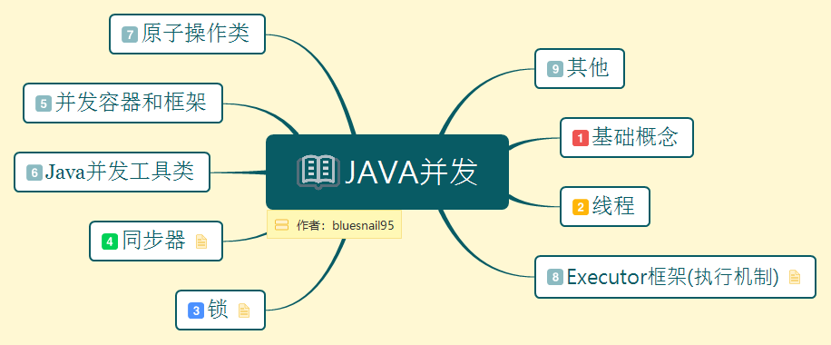

(1)基础概念

(2)线程

(3)锁

(4)同步器

(5)并发容器和框架

(6)Java并发工具类

(7)原子操作类

(8)Executor框架(执行机制)

(9)其他

****

(一).基础概念

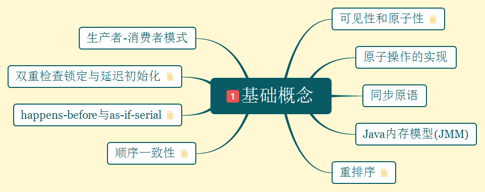

1.可见性和原子性

- 可见性：一个线程修改了共享变量的值，另一个线程可以读到这个修改的值。

- 原子性：不可被中断的一个或一系列操作。

如何保障原子性：

- 使用总线锁保证原子性。

- 使用缓存锁保证原子性。

2.原子操作的三种实现：


(1).CAS(Compare And Swap 比较与交换)

需要输入两个数值(一个旧值和一个新值)，在操作期间先比较旧值有没有发生变化，如果没有发生变化，才交换成新值，如果发生了变化就不交换。

存在的三大问题：

- ABA问题：如果一个值原来是A，变成了B，又变成了A，那么使用CAS进行检查时会发现它的值没有发生变化，但是实际是发生了变化。解决方案：1.使用版本号，在变量前面追加版本号，每次变量更新都把版本号加1。JDK提供的类：AtomicStampedReference。

- 循环时间长开销大。

- 只能保证一个共享变量的原子操作。
解決方案：JDK提供AtomicReference类来保证引用对象之间的原子性，可以把多个变量放在一个对象里进行CAS操作。


(2).锁

(3).JDK并发包的支持

如:AtomicBoolean(用原子方式更新的boolean值)，

   AtomicInteger(用原子方式更新的int值)，

   AutomicLong(用原子方式更新的long值)。

3.同步原语

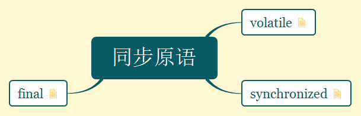

(1).volatile

特点:

 - 可见性：对一个volatile变量的读，总是能看到任意线程对这个volatile变量最后的写入。

 - 原子性：对任意单个volatile变量的读/写具有原子性。

 - 从内存语义角度：volatile的写-读与锁的释放-获取有相同的内存效果。

 - 为了实现volatile的内存语义，编译期在生成字节码时，会在指令序列中插入内存屏障来禁止特定类型的处理器重排序。

 - 从编译器重排序规则和处理器内存屏障插入策略来看，只要volatile变量与普通变量之间的重排序可能会破坏volatile的内存语义，这种重排序就会被编译器重排序规则和处理器内存屏障插入策略禁止。

实现原理：

- 将当前处理器缓存行的数据回写到系统内存。

- 写回内存的操作会使其他CPU里缓存该内存地址的数据无效。

(2).synchronized

不同情況锁住的对象：

- 对于普通同步方法，锁是当前实例对象。

- 对于静态同步方法，锁是当前类的Class对象。

- 对于同步方法块，锁是Synchronized括号里配置的对象。


(3)final

```

public class FinalExample {

	int i;                     //普通变量
	final int j;               //final变量
	static FinalExample obj;
	
	public FinalExample() {    //构造函数
		i = 1;                 //写普通域
		j = 2;                 //写final域
	}
	
	public static void writer() {
		obj = new FinalExample();
	}
	
	public static void reader() {
		FinalExample object = obj;    //读对象引用
		int a = object.i;             //读普通域
		int n = object.j;             //读final域
	}
}

```

- 写final域的重排序规则：JMM禁止将final域的写重排序到构造函数之外。
- 读final域的重排序规则：在一个线程中，初次读对象引用与初次读该对象包含的final域，JMM禁止处理器重排序这两个操作。

4.Java内存模型(JMM)

Java内存模型的主要目标是定义程序中各个变量的访问规则，即在虚拟机中将变量存储到内存和从内存中取出变量这样的底层细节。

5.重排序

重排序的3种类型：

- 编译器优化的重排序。

- 指令级并行的重排序。

- 内存系统的重排序。

编译器和处理器在重排序时，会遵守数据依赖性，编译器和处理器不会改变存在数据依赖关系的两个操作的执行顺序。

6.顺序一致性

顺序一致性内存模型两大特征：

- 一个线程中的所有操作必须按照程序的顺序来执行。

- （不管程序是否同步)所有线程都只能看到一个单一的操作执行顺序。在顺序一致性内存模型中，每个操作都必须原子执行且立刻对所有线程可见。

7.happens-before与as-if-serial

JMM对happens-before的设计原则：只要不改变程序的执行结果（指的是单线程程序和正确同步的多线程程序），编译器和处理器怎么优化都行。

happens-before关系的定义：

(1)如果一个操作happens-before另一个操作，那么第一个操作的执行结果将对第二个操作可见，而且第一个操作的执行顺序排在第二个操作之前。

(2)两个操作之间存在happens-before关系，并不意味着Java平台的具体实现必须要按照happens-before关系指定的顺序来执行。如果重排序之后的执行结果，与按happens-before关系来执行的结果一致，那么JMM允许这种重排序。

as-if-serial：不管怎么重排序(编译器和处理器为了提高并行度)，（单线程）程序的执行结果不能被改变。

區別：as-if-serial语义保障单线程内程序的执行结果不被改变，happens-before关系保证正确同步的多线程程序的执行结果不被改变。

8.双重检查锁定与延迟初始化

使用双重检查锁延迟初始化

```

public class DoubleCheckedLocking {                         
	
	private static DoubleCheckedLocking instance;           
	
	public static DoubleCheckedLocking getInstance() {      
		if(null == instance) {                              
			synchronized(DoubleCheckedLocking.class) {      
				if(null == instance) {                      
					instance = new DoubleCheckedLocking();  
				}
			}
		}
		return instance;
	}
}

```
|  线程A                    |   线程B   |
| :----------------------  | :------- |
|A1：分配对象的内存空间       |           |
|A2：设置instance指向内存空间 |           |
|                           |B1：判断instance是否为空 |
|                           |B2：由于instance不为null，线程B将访问instance引用的对象 |
|A3：初始化对象               |            |
|A4：访问instance引用的对象    |         |

存在的问题：
A2和A3重排序，线程B访问到一个还没初始化的对象。

解决方案：

- 将instance变量声明为volatile型的。通过禁止重排序来保证线程安全的延迟初始化。

- 通过不允许其他线程”看到“这个重排序实现线程安全的延迟初始化。

```

public class InstanceFactory {

	private static class InstanceHolder {
		public static InstanceFactory instance = new InstanceFactory();
	}
	
	public static InstanceFactory getInstance() {
		return InstanceHolder.instance;
	}
}

```


9.生产者-消费者模式

****


(二).线程

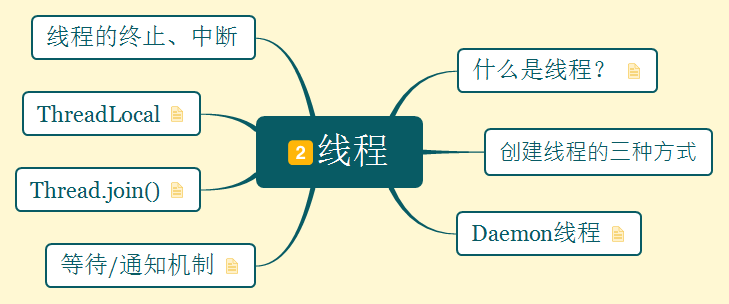

1.什么是线程？

现代操作系统在运行一个程序时，会为其创建一个进程。现代操作系统调度的最小单元是线程，也叫轻量级进程。在一个进程里可以创建多个线程，这些线程都拥有各自的计数器，堆栈和局部变量等属性。

2.创建线程的三种方式

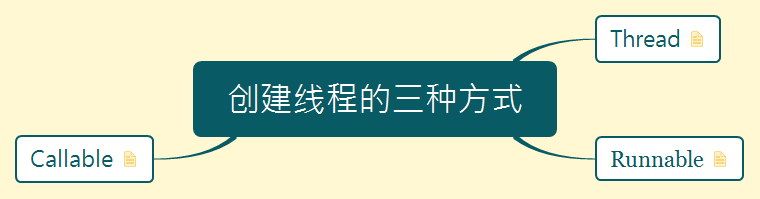

(1).Thread

```

@Test

public void testThread() {

	Thread thread = new Thread("myThread");
	thread.start();
}

```


(2).Runnable

```

@Test
public void testRunnable() {
	Thread thread = new Thread(new Runnable() {

		@Override
		public void run() {
			System.out.println("myThread");
		}
		
	});
	thread.start();
}

```

(3).Callable

```

@Test

public void testFutureTask() throws InterruptedException, ExecutionException {

	ExecutorService executorService = Executors.newFixedThreadPool(2);
	Future<String> future = executorService.submit(new Callable<String>() {

		@Override
		public String call() throws Exception {
			return "Hello,World!!!";
		}
		
	});
	String result = future.get();
	System.out.println(result);
	executorService.shutdown();
	
}

```

3.Daemon线程

- Daemon线程是一种支持型线程，因为它主要被用作程序中后台调度以及支持性工作。
- 当一个Java虚拟机中不存在非Daemon线程的时候，Java虚拟机将会退出。
- 可以通过调用Thread,setDaemon(true)将线程设置为Daemon线程。

4.等待/通知机制

等待/通知机制，是指一个线程A调用了对象O的wait()方法进入等待状态，而另一个线程B调用了对象O的notify()或者notifyAll()方法，线程A收到通知后从对象O的wait()方法返回，进而执行后续操作。

等待方遵循如下规则：

- 获取对象的锁

- 如果条件不满足，那么调用对象的wait()方法，被通知后仍要检查条件。

- 条件满足则执行对应的逻辑。

```

while(条件不满足){
    对象.wait();
}

//处理对应的逻辑

```

通知方遵循如下规则：

- 获得对象的锁。

- 改变条件

- 通知所有等待在对象上的线程。

```

synchronized(对象){

        //改变条件
       对象.notifyAll();

}

```

5.Thread.join()

当前线程A要等待thread线程终止之后才能从thread.join()返回。

6.ThreadLocal

ThreadLocal，即线程变量，是一个以ThreadLocal对象为键，任意对象为值的存储结构。这个结构被附带在线程上，也就是说一个线程可以根据一个ThreadLocal对象查询到绑定到这个线程上的一个值。

7.线程的终止、中断

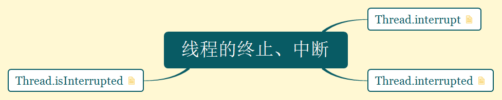

(1).Thread.interrupt:中断线程

- 除非线程正在进行中断它自身，否则都会接受这个方法的中断。会调用Thread.checkAccess()，可能会抛出SecurityException。

- 如果线程调用了Object.wait()，Thread.sleep()，Thread.join()处于阻塞状态，那它的堵塞状态会被清除，并得到一个InterruptedException。

- 如果线程在InterruptibleChannel上的I/O操作中被中断，通道会被关闭，线程的中断状态会被设置，并得到一个ClosedByInterruptedException。

(2).Thread.interrupted:测试当前线程是否被中断。

清除线程的中断状态。如果连续调用两次这个方法，第二次调用会返回false(除非当前线程再次被中断，在第一次调用清除它的中断状态之后，并且在第二次调用检查它之前）。

(3).Thread.isInterrupted:测试某个线程是否被中断

中断状态是否被重置取决于传入的值。

****

(三).锁

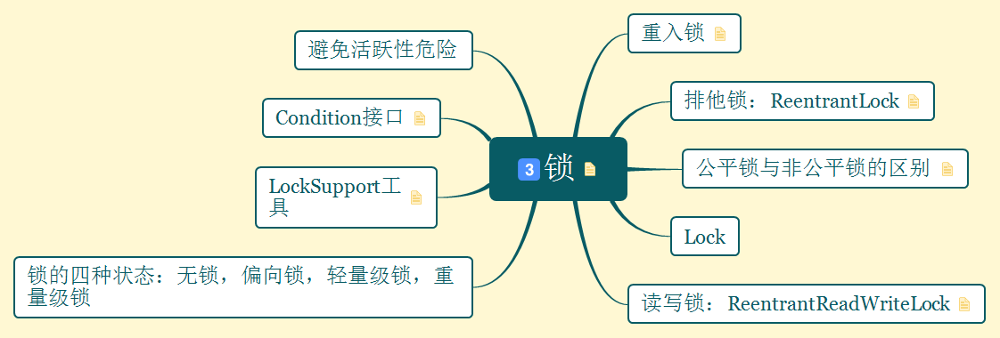

锁是Java并发编程中最重要的同步机制。锁除了让临界区互斥执行外，还可以让释放锁的线程向获取同一个锁的线程发送消息。

1.锁的内存语义：

- 利用volatile变量的写-读所具有的内存语义。

- 利用CAS所附带的volatile读和volatile写的内存语义。

2.重入锁

(1).什么是重入锁？
支持重进入的锁，表示锁能够支持一个线程对资源的重复加锁。重入锁支持获取锁时的公平性和非公平性选择。

(2).解决两个问题：

- 线程再次获取锁：锁需要去识别获取锁的线程是否为当前占据锁的线程，如果是，则再次获取锁。

- 锁的最终释放：锁的最终释放要求锁对于锁获取进行计数自增，计数表示当前锁被重复获取的次数，而锁被释放时，计数自减，当计数等于0时表示锁已经释放。

3.排他锁：ReentrantLock

(1)公平锁：

- 公平锁释放时，最后要写一个volatile变量state。

- 公平锁获取时，首先会去读volatile变量。

(2)非公平锁：

- 非公平锁释放时，最后要写一个volatile变量state。

- 非公平锁获取时，首先会用CAS(CompareAndSet)更新volation变量，这个操作同时具有volatile写和volatile读的内存语义。

(3)公平锁与非公平锁的区别

公平性与否是针对获取锁而言的。

- 公平锁：如果一个锁是公平的，那么获取锁的顺序就应该符合请求的绝对时间顺序，也就是FIFO。

- 非公平锁：刚释放锁的线程再次获取同步状态的几率会非常大，使得其他线程只能在同步队列中等待。

公平性锁保证了锁的获取按照FIFO原则，而代价是进行大量的线程切换。非公平性锁虽然可能造成”饥饿“，但极少的线程切换，保证其更大的吞吐量。

4.Lock

(1)读写锁：ReentrantReadWriteLock

读写锁在同一时刻可以允许多个读线程访问，但是在写线程访问时，所有的读线程和其他写线程均被堵塞。

读写锁的实现分析：

- 读写状态的设计：同步状态表示锁被一个线程重复获取的次数，而读写锁的自定义同步需要在同步状态(一个整型变量)上维护多个读线程和一个写线程的状态，使得该状态的设计成为读写锁实现的关键。

- 写锁的获取与释放：写锁是一个支持重进入的排它锁。如果当前线程已经获取了写锁，则增加写状态。如果当前线程在获取写锁时，读锁已经被获取（读状态不为0）或者该线程不是已经获取写锁的线程，则当前线程进入等待状态。

- 读锁的获取与释放：如果当前线程已经获取了读锁，就增加读状态。如果当前线程在获取读锁时，写锁已被其他线程获取，则进入等待状态。

- 锁降级：锁降级指的是写锁降级为读锁。指把持住（当前拥有的）写锁，再获取到读锁，随后释放（先前拥有的）读锁的过程。

锁的四种状态：无锁，偏向锁，轻量级锁，重量级锁

5.LockSupport工具

当需要阻塞或唤醒一个线程的时候，都会使用LockSupport工具类来完成相应的工作。

6.Condition接口

Condition接口提供了类似Object的监视器方法(包括wait()，wait(long timeout)，notify()，以及notifyAll()方法)，与Lock配合可以实现等待/通知模式。

Condition的实现：等待队列，等待和通知。

- 等待队列：等待队列是一个FIFO队列，在队列中的每一个节点都包含了一个线程引用，该线程是在Condition对象上等待的线程，如果一个线程调用了Condition.await()方法，那么该线程会释放锁，构造成节点加入等待队列并进入等待状态。

- 等待：调用Condition的await()方法（或者以await开头的方法），会使当前线程进入等待队列并释放锁，同时线程状态变为等待状态。当从await()方法返回时，当前线程一定获取了Condition相关的锁。

- 通知：调用Condition的signal()方法，将会唤醒在等待队列中等待时间最长的节点（首节点），在唤醒节点之前，会将节点移步到同步队列。


7.避免活跃性危险


a.死锁

- 哲学家用餐问题：每个线程都拥有别的线程需要的资源，同时又等待别人拥有的资源，在获得别的资源之前不会释放自己手上的资源。

- 数据库事务死锁：数据库如果发生死锁，会选择一个事务释放资源。

- 锁顺序死锁：线程A,B都需要锁1,2。线程A先获得锁1 ,再请求锁2 ，线程B先获得锁2，再请求锁1 。


b.死锁的避免与诊断

(1).内置锁：只要没有获得锁，就会一直等待下去。

(2).定时锁：使用Lock类的定时tyLock功能。可以指定一个超时时限，在等待超过该时间后会返回失败信息。

(3).线程转储

避免死锁的四种方式:

- 避免一个线程同时获得多个锁。

- 避免一个线程在锁内同时占用多个资源，尽量保证每个锁只获得一个资源。

- 使用定时锁。

- 对于数据库锁，加锁和解锁必须在一个数据库连接里，否则会出现解锁失败的情况。


c.饥饿，糟糕的响应性，活锁

- 饥饿：线程由于无法访问它需要的资源而不能继续执行，引发饥饿最常见的资源是CPU时钟周期。

- 活锁通常发送在处理事务消息的应用程序中，如果不能成功地处理事务消息，那么消息机制将回滚整个事务，将这个事务放在等待队列的开头。

- 当多个相互协作的线程都对彼此响应从而修改各自的状态，并使得任何一个线程都无法继续执行时，就发生了活锁。

- 在并发应用中，通过等待随机长度的时间和回退可以有效地避免活锁的发生。


****

(四).同步器


(1).实现

- 同步队列：同步器依赖内部的同步队列(一个FIFO双向队列)来完成同步状态的管理，当前线程获得同步状态失败时，同步器会将当前线程以及等待状态等信息构造成为一个节点并将其加入同步队列，同时会阻塞当前线程，当同步状态释放时，会把首节点中的线程唤醒，使其再次尝试获取同步状态。

- 独占式同步状态获取与释放：在获取同步状态时，同步器维护一个队列，获取状态失败的线程会被加入队列中并在队列中进行自旋，移除队列的原因时自旋获取了同步状态且前驱节点时头节点。在释放同步状态时，同步器调用tryRelease(int arg)方法释放同步状态，然后唤醒头节点的后继结点。 

- 共享式同步状态获取与释放：共享式获取与独占式获取最主要的区别在于同一时刻能否有多个线程同时获取同步状态。

- 独占式超时获取同步状态：在指定的时间段内获取同步状态，如果获取到同步状态返回true，否则，返回false。

(2).AbstractQueuedSynchronized

用来构建锁或者其他同步组件的基础框架，使用了一个int成员变量表示同步状态，通过内置的FIFO队列来完成资源获取线程的排队工作。

提供了三个对同步状态进行修改的方法：

- getState()：获取当前同步状态。

- setState(int new3State)：设置当前同步状态。

- compareAndSetState(int export,int update)：使用CAS设置当前状态，该方法能够保证状态设置的原子性。

****

(五).并发容器和框架

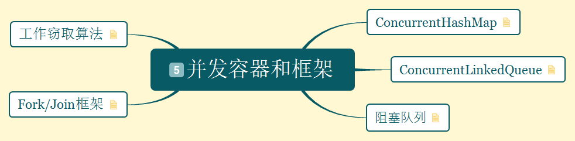

(1).ConcurrentHashMap

与HashMap,HashTable对比：

- HashMap是线程不安全，且可能导致程序死循环。

- HashTable效率低下。

- ConcurrentHashMap的锁分段技术可有效提升访问效率。首先将数据分成一段一段的存储，然后给每一段数据配一把锁，当一个线程占用锁访问其中一个段的数据的时候，其他段的数据也能被其他线程访问。

ConCurrentHashMap的结构：ConCurrentHashMap是由Segment数组结构和HashEntry数组结构组成。

(2).ConcurrentLinkedQueue

ConcurrentLinkedQueue由head节点和tail节点组成，每个节点(Node)由节点元素(item)和指向下一个节点(next)的引用组成，从而组成一张链表结构的队列。

(3).阻塞队列

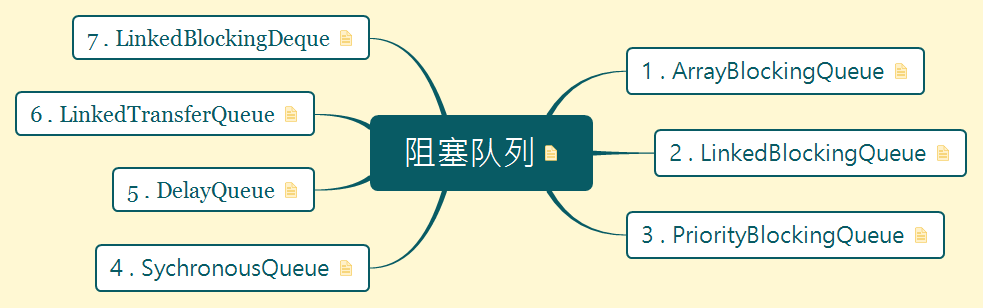

- 插入：当队列满时，队列会堵塞插入元素的线程，直到队列不满。

- 移除：当队列为空，获取元素的线程会等待线程为非空。

实现原理：
使用通知模式实现。当生产者往满的队列里添加元素时会堵塞生产者，当消费者消费了一个队列中的元素后，会通知生产者当前队列可用。

1.ArrayBlockingQueue

- 数组实现的有界阻塞队列，按照先进先出的原则对元素进行排序。

2.LinkedBlockingQueue

- 继承了AbstractQueue类，实现了BlockingQueue接口。

- 采用先进先出的排列方式，头结点是入队时间最长的元素，尾结点是入队时间最短的元素。新结点添加到队尾，从队头弹出结点。

- 链表队列的特点是：跟基于数组的队列相比有更大的吞吐量，但在大多并发应用中性能会比较差。

- LinkedBlockingQueue可以在创建的时候传递一个容量参数，限制队列的长度，不设定的情况下，默认是Integer.MAX_VALUE。在没有超过队列边界的情况下，每次添加会自动创建链表结点。

3.PriorityBlockingQueue

- 是一个支持优先级的无界阻塞队列。默认情况下时自然顺序升序排序。

4.SychronousQueue

- SynchronousQueue是一个不存储元素的堵塞队列，每一个put操作必须等待一个take操作，否则不能继续添加元素。

5.DelayQueue

- 延迟队列：无界队列，只有延迟过期的任务才能加入队列。队列的队首元素是在过去延迟过期最长的元素。如果没有延迟到期，队列中就没有元素，调用poll方法会返回null。当调用元素的getDelay(TimeUnit.NANOSECONDS)方法返回等于或小于0的值时，出现到期。

- DelayQueue的应用场景：a.缓存系统：把需要缓存的元素加入DelayQueue中，让一个线程循环测试是否能从DelayQueue中获取元素，能表示缓存到期。b.定时任务调度。

- Timer和DelayQueue的区别？Timer只能处理单个后台线程，而DelayQueue可以处理多个。


6 . LinkedTransferQueue

- LinkedTransferQueue是一个由链表结构组成的无界阻塞TransferQueue队列。

7 . LinkedBlockingDeque

- 一个由链表结构组成的双向阻塞队列，可以运用在“工作窃取”模式中。

(4).Fork/Join框架

用于并行执行任务，把一个大任务分割成小任务，再把每个小任务的结果汇总成大任务结果。Fork是把一个大任务切分成若干子任务并行执行，Join是合并这些子任务的执行结果。

(5).工作窃取算法

指某个线程从其他队列里窃取任务来执行。为了减少窃取任务线程和别窃取任务线程之间的竞争，使用双端队列，被窃取任务线程从双端队列的头部拿任务执行，窃取任务线程从双端队列的尾部拿任务执行。

- 工作窃取算法的优点：充分利用线程进行并行计算，减少线程间的竞争。

- 工作窃取算法的缺点：在某些情况下还是存在竞争，比如双端队列里只有一个任务时，并且该算法会消耗更多的系统资源，比如创建多个线程和多个双端队列。

****

(六).Java并发工具类

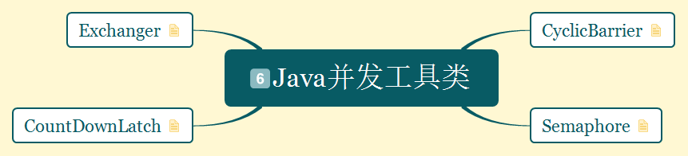

1.CyclicBarrier

一组线程在到达一个屏障（同步点）前被堵塞，直到最后一个线程到达屏障时，屏障才会放行，这组线程才能继续执行。

应用场景：可以用于多线程计算数据，最后合并计算结果。

CyclicBarrier与CountDownLatch的区别：CountDownLatch的计数器只能使用一次，而CyclicBarrier的计数器可以使用reset()方法重置。CountDownLatch的计数是减法，CyclicBarrier的计数是加法。

2.Semaphore

用来控制同时访问特定资源的线程数量，通过协调各个线程，以保证合理的使用公共资源。

应用场景：可以用于流量控制，特别是公共资源有限的应用场景，比如数据库连接。

3.CountDownLatch

允许一个或多个线程等待其他线程完成操作。

4.Exchanger

Exchanger是一个用于线程间协作的工具类。Exchanger用于进行线程间的数据交换。它提供一个同步点，在这个同步点，两个线程可以交换彼此的数据。这两个线程通过exchange方法交换数据，如果第一个线程先执行exchange()方法，会一直等待第二个线程也执行exchange()方法，当两个线程都到达同步点时，这两个线程就可以交换数据，将本线程生产出来的数据传递给对方。

应用场景：用于遗传算法。

****

(七).原子操作类


1.原子更新基本类型类

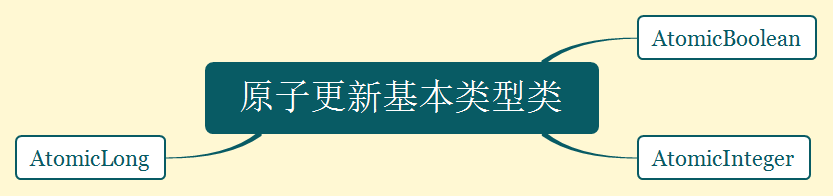

- AtomicBoolean

- AtomicInteger

- AtomicLong

2.原子更新数组

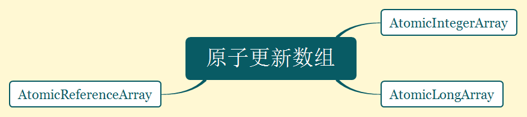

- AtomicIntegerArray

- AtomicLongArray

- AtomicReferenceArray

3.原子更新引用类型


- AtomicReference

- AtomicReferenceFieldUpdater 原子更新引用类型里的字段

- AtomicMarkableReference 原子更新带有标记位的引用类型。

4.原子更新字段类

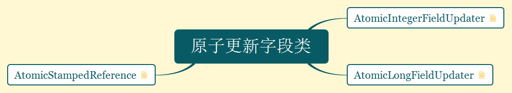

- AtomicIntegerFieldUpdater 原子更新整型的字段的更新器

- AtomicLongFieldUpdater 原子更新长整型字段的更新器

- AtomicStampedReference 原子更新带有版本号的引用类型。该类将整数值与引用关联起来，可用于原子的更新数据和数据的版本号，可以解决使用CAS进行原子更新时可能出现的ABA问题。

****

(八).Executor框架(执行机制)

.jpg)

从JDK5开始，把工作单元和执行机制分离开来，工作单元包括Runnable和Callable，而执行机制由Executor框架提供。

1.异步计算的结果：FutureTask和Future

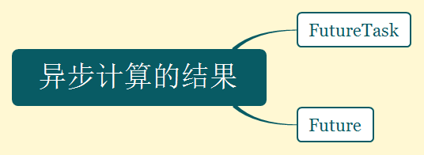

2.任务执行


(1).Executor(核心接口)

.jpg)

Executor的生命周期：创建，提交，开始，完成

(2).ExecutorService接口(继承自Executor)

.jpg)

- ExecutorService的生命周期：运行，关闭，已终止

- ExecutorService.shutDown和ExecutorService.shutDownNow的区别

| 调用的方法 |   作用        |
| ----------|:-------------| 
| shutDown  |  不再允许新的任务添加到等待队列，正在执行的任务和在等待队列中的任务会执行完毕再关闭。|
| shurDownNow | 立刻关闭。需要知道正在执行但是还没执行完毕的任务。|

- ExecutorService.submit()和ExecutorService.execute()的区别:接口ExecutorService的execute()方法是继承自Executor。

| 调用的方法 |   作用        |
| ----------|:-------------| 
| execute  |  用于提交不需要返回值的任务，所以无法判断任务是否被线程池执行成功。|
| submit | 用于提交需要返回值的任务。线程池会返回一个Future类型的对象，通过这个Future对象可以判断任务是否执行成功，并且通过Future的get()方法来获取返回值，get()方法会阻塞线程直到任务完成。|

- ExecutorService的创建：


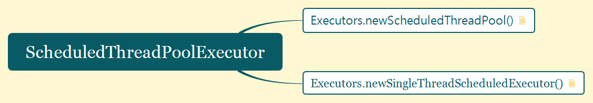

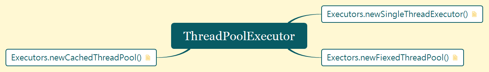

| 调用 |     分类   |   使用        |
| :----------|:-----|:-------------| 
| Executors.newSingleThreadExecutor()|ThreadPoolExecutor |应用场景：适用于需要保证顺序地执行各个任务；并且在任意时间点，不会有多个线程活动的应用场景。|
| Exectors.newFiexedThreadPool()|ThreadPoolExecutor | 1.创建一个线程池，具有固定线程数，运行在共享的无界队列中。2.在大多数时候，线程会主动执行任务，当所有的线程都在执行任务时，有新的任务加入进来，就会进入等待队列(可以有源源不断的任务加入进来，因为是无界队列)，当有空闲的线程，等待队列中的任务就会被执行。3.如果有线程在执行过程中因为执行失败要关闭，新创建的线程会替失败的线程执行接下来的任务。4.如果想要关闭这个线程池，可以调用ExecutorService的shutDown方法。应用场景：适用于为了满足资源管理的需求，而需要限制当前线程数量的应用场景，它适用于负载比较重的服务器。|
|Executors.newCachedThreadPool()|ThreadPoolExecutor  | 应用场景：适用于执行很多短期异步任务的小程序，或者是负载较轻的服务器。|
|Executors.newScheduledThreadPool()| ScheduledThreadPoolExecutor|应用场景：适用于需要多个后台线程执行周期任务，同时为了满足管理的需求而需要限制后台线程的数量的应用场景。|
|Executors.newSingleThreadScheduledExecutor()|ScheduledThreadPoolExecutor|应用场景：需要单个后台线程执行周期任务，同时需要保证顺序地执行各个任务。|

3.任务:Runnable接口和Callable接口

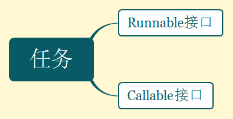

****

(九).其他

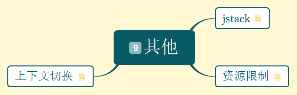

1.jstack

打开cmd，输入：

- jps      查看pid(进程号)

- jstack pid         

2.资源限制：指在进行并发编程时，程序的执行速度受到计算机硬件资源或软件资源的限制。

3.上下文切换

减少上下文切换的方法：

- 无锁并发编程

- CAS算法

- 使用最少线程

- 使用协程
